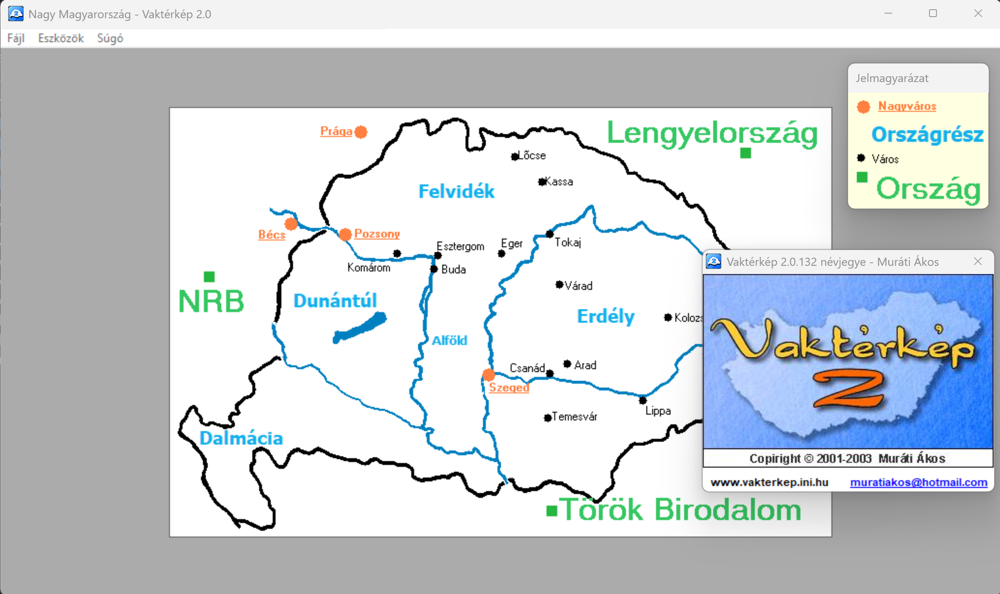
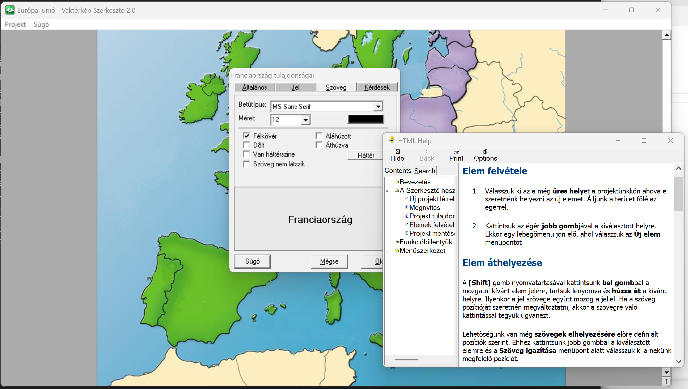
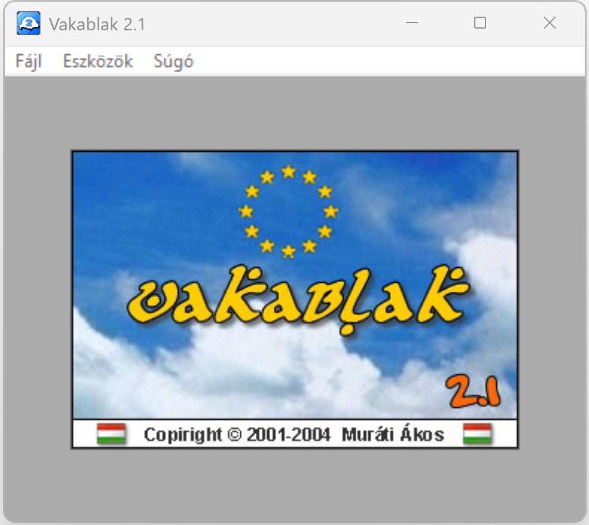

# Vakablak
> This is a project archive. Source is not maintained since 2004

A Vakablak (ex Vaktérkép) eredetileg egy geografiai oktató program,
ami földrajzi és történelemi helyszínek megismerésével és begyakorlásával
segít elsajátítani az ismereteket, ám dimanikus szerkesztőjével lehetőség
van egyéb vizuális oktatóanyagok és gyakorlók készítésére is.

## Project folder structure
 - `Design` - Graphical assets and design templates
 - `Help` - Help files resources and CHM compiles
 - `Resources` - Folder containing base maps, symbols and flag resources
 - `Projects` - Folder containing example project files
 - `Setup` - Setup resources for NSIS installers
 - `Source` - Visual Studio 6 - VB project and source files

For binary compilations, dependency and setup files, check releases.

## Installation
Download the latest release and execute the installer.

## Development Requirements
 - Visual Studio 6
    - Visual Basic 6.0 language support

